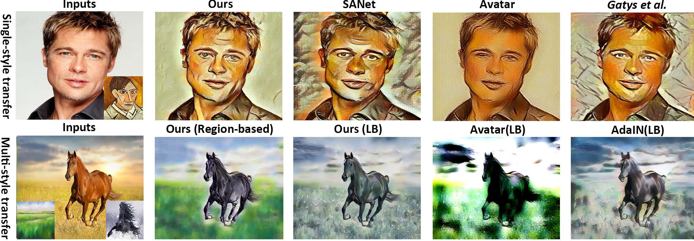

# Style Mixer: Semantic-aware Multi-Style Transfer Network
A semantic-aware multi-style transfer network that automatically incorporates multiple styles based on the regional semantics.

> [**Style Mixer: Semantic-aware Multi-Style Transfer Network**](http://arxiv.org/abs/1904.07850),            
> Zixuan HUANG*, Jinghuai Zhang*, Jing Liao,        
> *arXiv technical report ([arXiv 1910.13093](https://arxiv.org/abs/1910.13093))*   

## Abstract

Recent neural style transfer frameworks have obtained astonishing visual quality and flexibility in Single-style Transfer (SST), but little attention has been paid to Multi-style Transfer (MST) which refers to simultaneously transferring multiple styles to the same image. Compared to SST, MST has the potential to create more diverse and visually pleasing stylization results. In this paper, we propose the first MST framework to automatically incorporate multiple styles into one result based on regional semantics. We first improve the existing SST backbone network by introducing a novel multi-level feature fusion module and a patch attention module to achieve better semantic correspondences and preserve richer style details. For MST, we designed a conceptually simple yet effective region-based style fusion module to insert into the backbone. It assigns corresponding styles to
content regions based on semantic matching, and then seamlessly combines multiple styles together.

## Get started
Firstly, download the pretrained model by running
~~~
sh checkpoint/download_models.sh
~~~

### Testing
You can find 10 pairs of images in folder *input*. 5 for multi-style transfer and 5 for single-style transfer. To run the predefined samples, please use the following command, with task being s1 ... s5 or m1 ... m5.
~~~
python3 test_mult.py --name styleMixer_bw1_style3.00_cont3.00_iden1.00_cx3.00_1 --pre_def task
~~~
 For multi-style transfer, please use comma to separate different style references.
~~~
python3 test_mult.py --name styleMixer_bw1_style3.00_cont3.00_iden1.00_cx3.00_1 --content path_to_content_image --style path_to_style1,path_to_style_2...
~~~

### Training
To train the model with default setting, all you need is to specify the locations of the datasets. You can also specify the patch size of patch attention module by `p_size`.
~~~
python3 main.py --content_dir path_to_coco --style_dir path_to_wikiart
~~~
## Citation
If you find this project useful for your research, please use the following BibTeX entry.

    @article {10.1111:cgf.13853,
      journal = {Computer Graphics Forum},
      title = {{Style Mixer: Semantic-aware Multi-Style Transfer Network}},
      author = {HUANG, Zixuan and 张, 景淮 and LIAO, Jing},
      year = {2019},
      publisher = {The Eurographics Association and John Wiley & Sons Ltd.},
      ISSN = {1467-8659},
      DOI = {10.1111/cgf.13853}
    }
